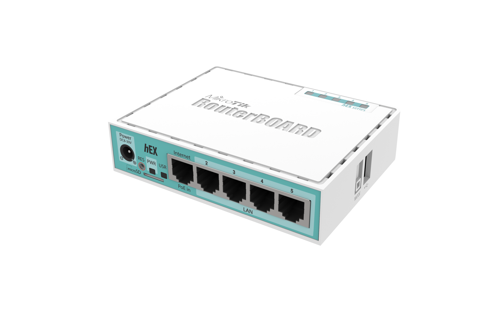

## About

[Mikrotik hEX](https://mikrotik.com/product/RB750Gr3) (RB750Gr3)


## [TMDB](https://www.themoviedb.org/) access
[src link](https://itdog.info/kak-vernut-oblozhki-the-movie-database-s-pomoshchyu-openwrt-iz-rossii/)

Use it for tinyMediaManager

In Terminal 

```
ip dns static>
```
Then paste
```
add regexp=".*\\.themoviedb\\.org\$" forward-to=9.9.9.9
add regexp=".*\\.tmdb\\.org\$" forward-to=9.9.9.9
add name=tmdb-image-prod.b-cdn.net forward-to=9.9.9.9
```

Another way

IP --> DNS --> Static


Check example
```
put [resolve api.tmdb.org]
```
```
put [resolve api.themoviedb.org]
```

## Wireguard setup